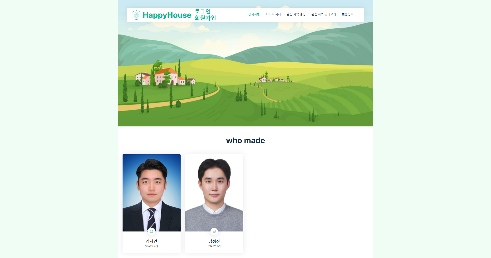
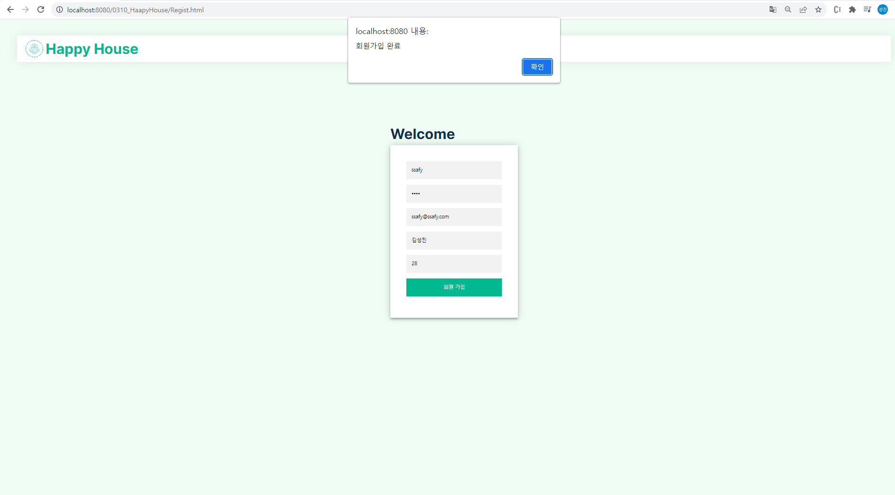
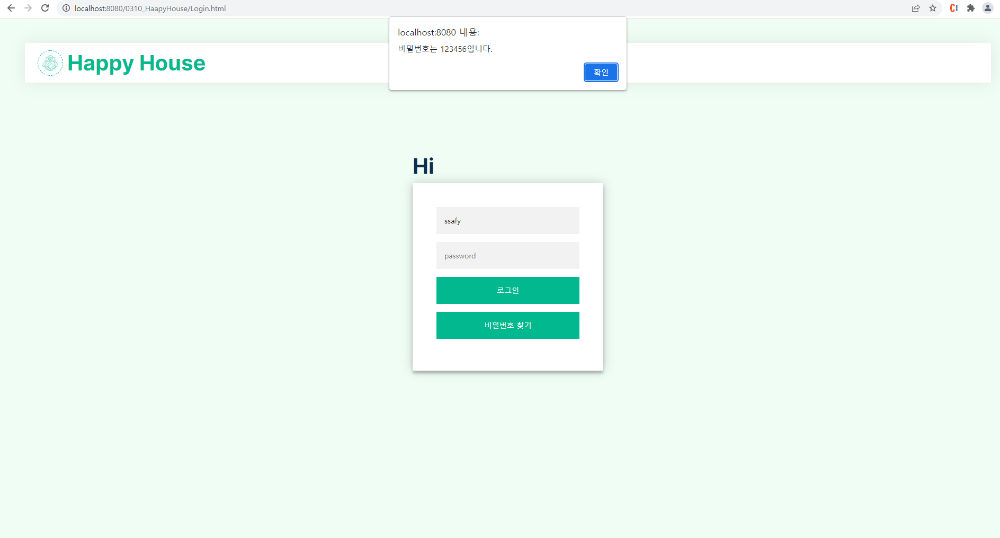
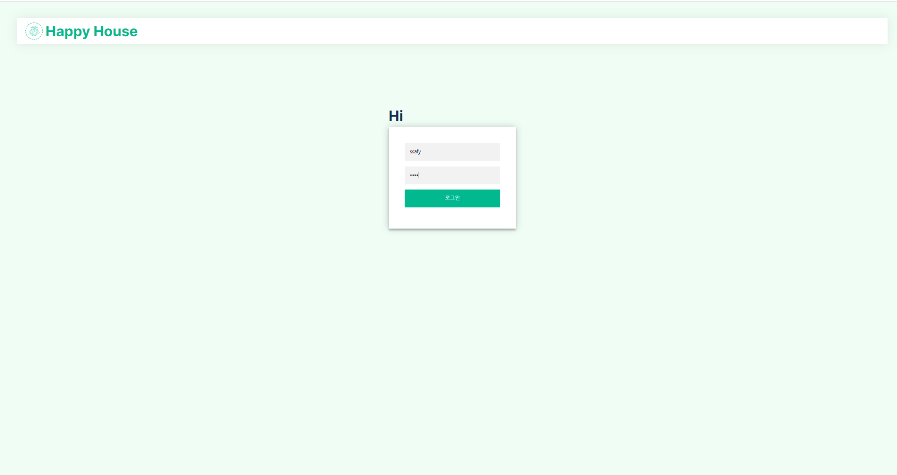
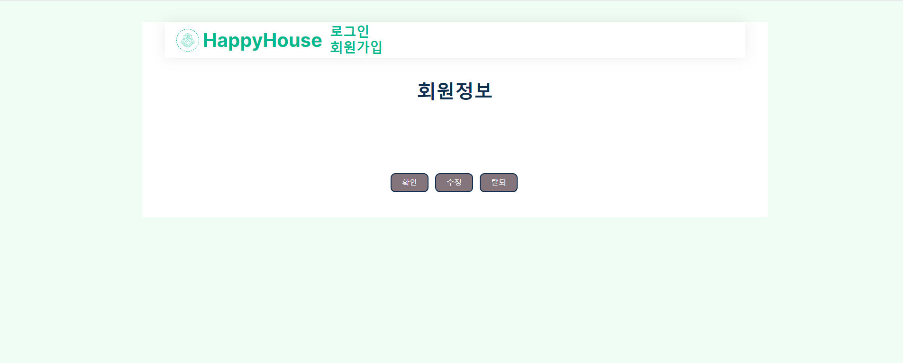
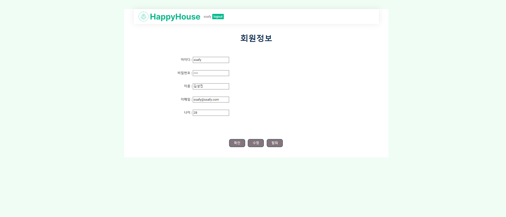
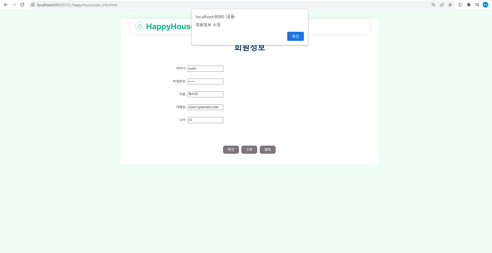
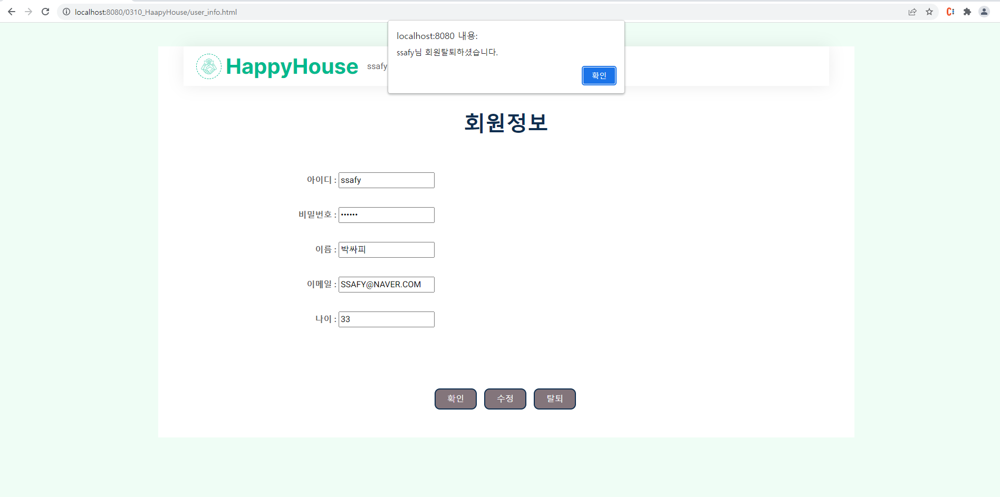
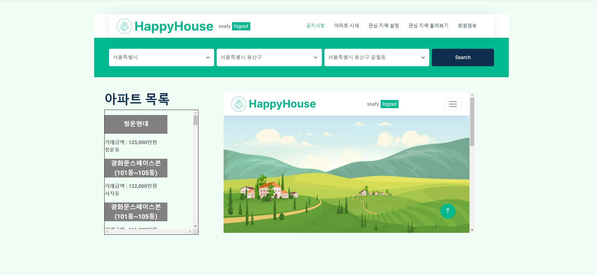
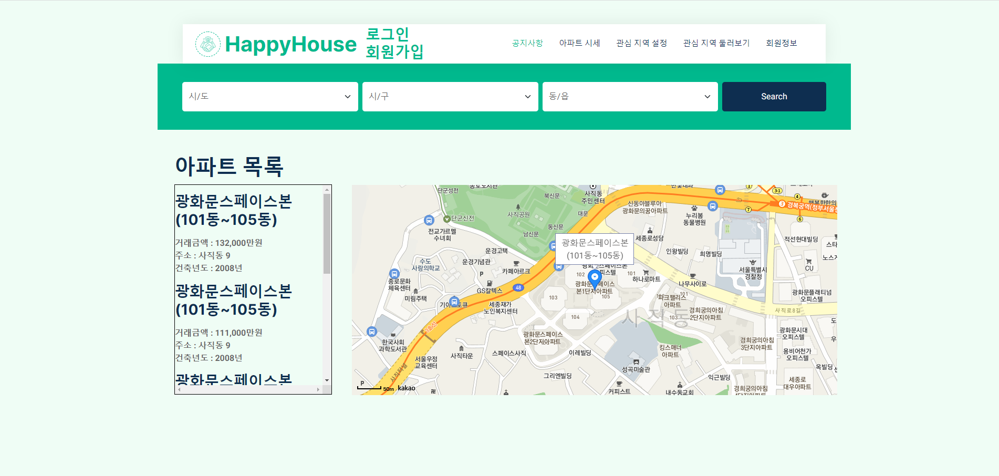

# member

pair1
김시언 김성진

## 요구사항
<table class="table table-bordered">
    <thead>
      <tr>
        <th>구현 기능</th>
        <th>구현 여부</th>
      </tr>
    </thead>
           <tr>
        <td align="center">메인페이지 및 메뉴 구성</td>
        <td align="center">○</td>
      </tr>
            <tr>
        <td align="center">회원페이지</td>
        <td align="center">○</td>
      </tr>
            <tr>
        <td align="center">로그인/로그아웃 페이지</td>
        <td align="center">○</td>
      </tr>
            <tr>
        <td align="center">실거래가 조회, 결과 페이지</td>
        <td align="center">○</td>
      </tr>
            <tr>
        <td align="center">화면 별 javascript기능</td>
        <td align="center">○</td>
      </tr>
            <tr>
        <td align="center">비밀번호 찾기/메뉴구성 화면</td>
        <td align="center">○</td>
      </tr>
      
  </table>

## 구조
| HTML |  |
| ------ | ------ |
| index.html | 메인페이지 |
| Regist.html | 회원가입페이지 |
| Login.html | 로그인페이지 |
| user.info.html | 회원정보페이지 |
| apr_info.html | 아파트정보페이지 |

| JavaScript |  |
| ------ | ------ |
| main.js | 부트스트랩 JS |
| my.js | 직접 코딩한 JS |

| CSS |  |
| ------ | ------ |
| bootstrap.min.css | 부트스트랩 CSS |
| style.css | 직접 코딩한 CSS |

## 결과화면
<h4>-로그인 전 메인페이지 <h4/>

<h4>- 회원가입 화면 <h4/>

<h4>- 비밀번호 찾기 화면 <h4/>

<h4>- 로그인 화면 <h4/>

<h4>- 로그인 후 메인페이지 <h4/>

<h4>- 로그인 전 회원정보 <h4/>

<h4>- 로그인 후 회원정보 <h4/>

<h4>- 회원정보 수정 <h4/>

<h4>- 회원 탈퇴 <h4/>

<h4>- 아파트 시세 정보 조회 <h4/>

<h4>- 아파트 상세 정보 조회 <h4/>

