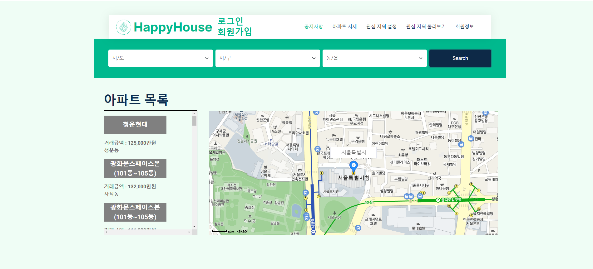

# member

pair1
김시언 김성진

## 요구사항

## 구조

## 결과화면
<h4>-로그인 전 메인페이지 <h4/>

<h4>- 회원가입 화면 <h4/>

<h4>- 비밀번호 찾기 화면 <h4/>

<h4>- 로그인 화면 <h4/>

<h4>- 로그인 후 메인페이지 <h4/>

<h4>- 로그인 전 회원정보 <h4/>

<h4>- 로그인 후 회원정보 <h4/>

<h4>- 회원정보 수정 <h4/>

<h4>- 회원 탈퇴 <h4/>

<h4>- 아파트 시세 정보 조회 <h4/>

<h4>- 아파트 상세 정보 조회 <h4/>

## 제출 소스
| ClassName  code line No. | code                                                         |
| ------------------------ | :----------------------------------------------------------- |
| HouseInfoView 246~247      ||
| HouseServiceImpl 34        ||
| HouseDaoImpl  80 (이미지추가) 	         ||
| APTRentSAXHandler 28~      ||
| HouseDealSAXHandler        ||
| EnvSCVParser (csv 읽고 가공하기)   ||
| EnvServiceImpl        ||
| MarketSCVParser        ||
| MarketServiceImpl        ||
